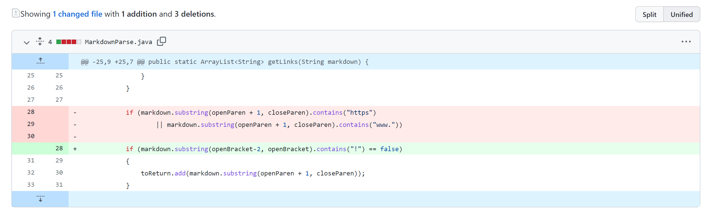
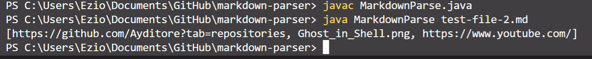
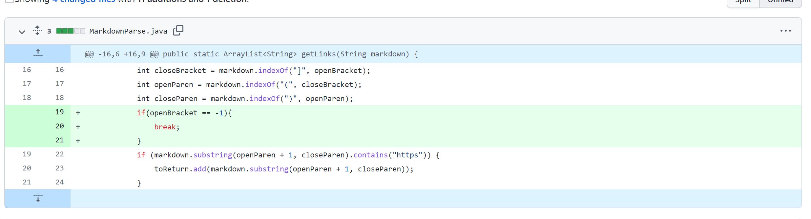
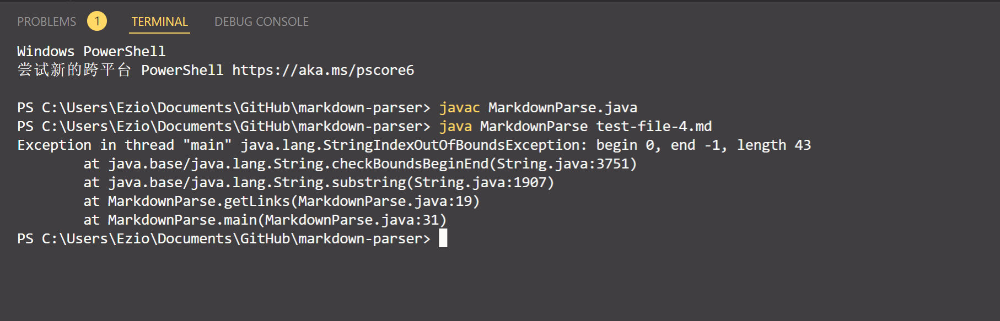
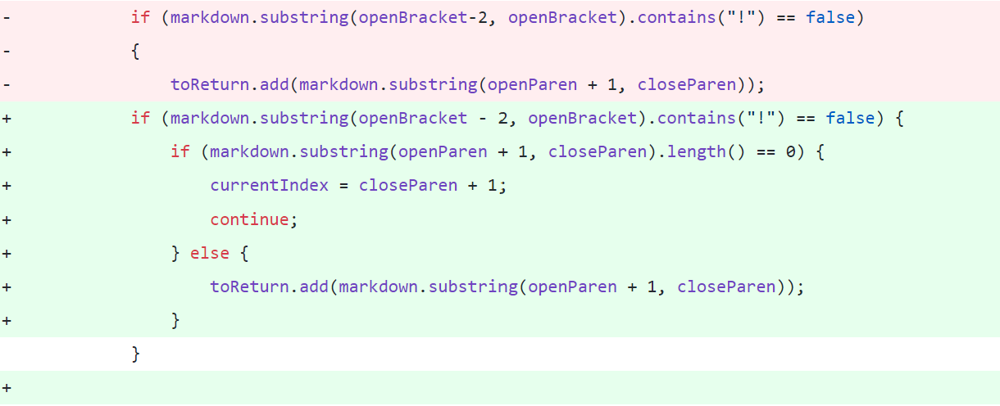
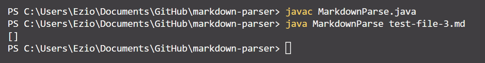

# Welcome to Anthony's Lab Report

In this report, I would like to show you three code change. These changes are made to fix the symptom caused by failure-inducing input  
  
  
## First Code Change: Avoid Reference to Image  

**Screenshot of the first code change difference implemented to fix bug**  
  

**Link to the fist test file**  
[First test case link](https://github.com/Ayditore/markdown-parser/blob/main/test-file-2.md) 

**1st Symptom I saw when I ran my code before first code changing**  
  

**Description of the relationship between the bug, the symptom, and the failure-inducing input**  
The symptom I saw is that the output of the program includes the reference to the picture when I expected only url included in the output.  
From the lab instruction document, I noticed that the output should only include url.  
So I think the symptom is shown because the method cannot differentiate a reference from a url in the input.  
After reading the feedback, I realized that the class wants us to differentiate a picture from a url by
handle the `!` in image links instead of using `https` or `www`.
Thus, I updated my file to differentiate whether the link has a `!` to determine if a link is a url or a picture.

---
## Second Code Change: Situation when the file contains no links  

**Screenshot of the second code change difference implemented to fix bug**  
  

**Link to the second test file**  
[Second test case link](https://github.com/Ayditore/markdown-parser/blob/main/test-file-4.md)  

**2nd Symptom I saw when I ran my code before 2nd code changing**  
  

**Description of the relationship between the bug, the symptom, and the failure-inducing input**    
The second symptom I saw is that I met a java outofbound error when running the code.  
I think this symptom is caused by the system cannot find open bracket in the file.  
Then, to fix the bug, I added a if statement to return a empty list if no url bracket is found.  

---
## Third Code Change: Situation when the file contains a line uses () and [] but not for the purpose of url link

**Screenshot of the third code change difference implemented to fix bug**  
  

**Link to the third test file**  
[Third test case link](https://github.com/Ayditore/markdown-parser/blob/main/test-file-3.md)  

**3rd Symptom I saw when I ran my code before 2nd code changing**  
  

**Description of the relationship between the bug, the symptom, and the failure-inducing input**  
The third sympton I saw is that the program output a list of url but includes a blank space.  
I think it is because the program cannot differentiate a blank url space from a url link.  
To fix this issue, I added a if statement to check if the content inside [] is blank.  
After the code change, the program's output will no onger contains blank url.  
