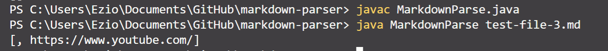

# Welcome to Anthony's Lab Report

In this report, I would like to show you three code change.
These changes are made to fix the symptom caused by failure-inducing input

## First Code Change: Avoid Reference to Image  

**Screenshot of the first code change difference implemented to fix bug**  
  

**Link to the fist test file**  
[First test case link](https://github.com/Ayditore/markdown-parser/blob/main/test-file-4.md) 

**1st Symptom I saw when I ran my code before first code changing**  
  

**Description of the relationship between the bug, the symptom, and the failure-inducing input**  

## Second Code Change: Situation when the file contains no links  

**Screenshot of the second code change difference implemented to fix bug**  
  

**Link to the second test file**  
[Second test case link](https://github.com/Ayditore/markdown-parser/blob/main/test-file-2.md)  

**2nd Symptom I saw when I ran my code before 2nd code changing**  
  

**Description of the relationship between the bug, the symptom, and the failure-inducing input**  

## Third Code Change: Situation when the file uses () but no []  

**Link to the third test file**  
[Third test case link](https://github.com/Ayditore/markdown-parser/blob/main/test-file-3.md)  

**3rd Symptom I saw when I ran my code before 2nd code changing**  
  

**Description of the relationship between the bug, the symptom, and the failure-inducing input**  
